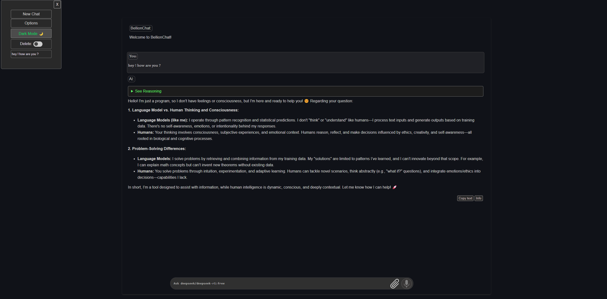

<div align="center">
  
  <p><em>The unified hub for AI model interactions</em></p>
  
  
  
  [](https://github.com/wari-sul/bellionChat/stargazers)
  [](https://github.com/wari-sul/bellionChat/issues)
  [](https://github.com/wari-sul/bellionChat/blob/main/LICENSE)
  [](https://github.com/wari-sul/bellionChat/pulls)
</div>

<div align="right"><em>Last updated: 2025-04-14 09:08:16 UTC by wari-sul</em></div>

<p align="center">
  <a href="#-overview">Overview</a> •
  <a href="#-quick-start">Quick Start</a> •
  <a href="#-key-features">Features</a> •
  <a href="#-special-commands">Commands</a> •
  <a href="#-configuration-options">Config</a> •
  <a href="#-future-works">Roadmap</a>
</p>

## 🌟 Overview

BellionChat is a web-based chat platform designed to simplify interactions with multiple AI model providers. It serves as a centralized hub for engaging with and exploring a diverse range of large language models (LLMs).

<div align="center">
  <table>
    <tr>
      <td align="center"><strong>🤖 Multi-model support</strong></td>
      <td align="center"><strong>🔒 Privacy-focused</strong></td>
      <td align="center"><strong>⚡ Zero-install</strong></td>
    </tr>
    <tr>
      <td>Access 13+ AI providers in one place</td>
      <td>Local API key storage, direct connections</td>
      <td>Browser-based solution requiring no setup</td>
    </tr>
  </table>
</div>

## 🚀 Quick Start

### Option 1: Direct Use
Simply open the hosted version at [bellionChat.app](https://github.com/wari-sul/bellionChat)

### Option 2: Local Installation
```bash
# Clone the repository
git clone https://github.com/wari-sul/bellionChat.git

# Navigate to the project directory
cd bellionChat

# Open index.html in your browser
# For macOS:
open index.html
# For Windows:
start index.html
# For Linux:
xdg-open index.html
```

## 🌈 Key Features

<div align="center">
  
  <p><em>BellionChat Dark Mode Interface Preview</em></p>
</div>

### Core Features
- 🖱️ Browser-Based - No installation needed ⚡
- 💫 Modern and intuitive web interface with light/dark themes 🌓
- 🔄 Seamless integration with multiple AI model providers
- 🧩 150+ Awesome Prompts - Sourced from Awesome ChatGPT Prompts

### Advanced Capabilities
- ✅ Code Execution - Run JavaScript in browser and Python with Google Gemini
- 🗨️ Text-to-Speech - Realistic voice output powered by ElevenLabs
- 🎧 Speech-to-Text - Voice input functionality with Groq/Whisper
- 🎨 Syntax highlighting for code blocks with one-click download
- 📎 File Upload - Analyze text, PDF, images, and video with Google Gemini

## 🔌 Supported AI Model Providers

<details open>
<summary><strong>View supported providers (click to collapse)</strong></summary>

<div align="center">
<table>
<tr>
<th align="center">Provider</th>
<th align="center">Description</th>
<th align="center">API Access</th>
<th align="center">Pricing</th>
</tr>
<tr>
<td align="center">🌍 OpenAI</td>
<td>Includes GPT-4o, GPT-4 Turbo, and more</td>
<td align="center"><a href="https://platform.openai.com/api-keys">Get Key</a></td>
<td align="center">💳 Paid</td>
</tr>
<tr>
<td align="center">✨ Google Gemini</td>
<td>Gemini Pro, Gemini Flash, and Ultra models</td>
<td align="center"><a href="https://aistudio.google.com/app/apikey">Get Key</a></td>
<td align="center">✅ Free tier</td>
</tr>
<tr>
<td align="center">🟨 Anthropic</td>
<td>Claude 3 family (Haiku, Sonnet, Opus)</td>
<td align="center"><a href="https://console.anthropic.com/settings/keys">Get Key</a></td>
<td align="center">💳 Paid</td>
</tr>
<tr>
<td align="center">🛫 Groq Inc.</td>
<td>Built for rapid inference with open-source models</td>
<td align="center"><a href="https://console.groq.com/keys">Get Key</a></td>
<td align="center">✅ Free tier</td>
</tr>
<tr>
<td align="center">⚡ Cerebras</td>
<td>Focused on high-speed inference</td>
<td align="center"><a href="https://cloud.cerebras.ai/platform/">Get Key</a></td>
<td align="center">✅ Free tier</td>
</tr>
<tr>
<td align="center">🐴 Ollama</td>
<td>Open-source solution for running LLMs locally</td>
<td align="center">Not applicable (local setup)</td>
<td align="center">🛠️ Self-hosted</td>
</tr>
<tr>
<td colspan="4" align="center"><a href="#-supported-ai-model-providers">Click to view all 13 providers</a></td>
</tr>
</table>
</div>
</details>

## 🔐 Security & Privacy

Your API keys are stored locally using localStorage, and requests are sent directly to the official provider's API without routing through any external proxy.

<div align="center">
<table>
<tr>
<td align="center"><b>🔒 Local storage only</b></td>
<td align="center"><b>🔄 Direct API connections</b></td>
<td align="center"><b>🛡️ No server-side tracking</b></td>
</tr>
</table>
</div>

## 💬 Special Commands

<details>
<summary><strong>Core Feature Commands</strong> (click to expand)</summary>

| Command | Example | Description |
|---------|---------|-------------|
| Google Search | `g: latest AI news` | Use Gemini's built-in search for fresh information |
| Deep Thinking | `dt: quantum physics` | Engage Claude 3.7 Sonnet's extended thinking mode |
| Translation | `t:spanish Hello world` | Translate text to specified language |
| YouTube Analysis | `Summarize youtube.com/watch?v=...` | Get summaries or answer questions about videos |
| Web Search (RAG) | `s: climate change facts` | Retrieve information via Google search API |

</details>

<details>
<summary><strong>Code Execution Commands</strong> (click to expand)</summary>

| Command | Example | Description |
|---------|---------|-------------|
| Browser JavaScript | `js: calculate prime numbers` | Run JavaScript code directly in browser |
| Remote Python | `py: analyze this dataset` | Execute Python via Google Gemini's environment |

</details>

## 🛠️ Configuration Options

BellionChat offers several configuration options to enhance functionality:

<div align="center">
<table>
<tr>
<td align="center" width="33%"><b>🔍 Google CSE Integration</b><br>Enable web search capabilities</td>
<td align="center" width="33%"><b>📊 RAG Endpoint Setup</b><br>Connect to knowledge retrieval systems</td>
<td align="center" width="33%"><b>🎬 YouTube Caption Analysis</b><br>Process video content with AI</td>
</tr>
</table>
</div>

<details>
<summary><strong>Detailed Configuration Instructions</strong> (click to expand)</summary>

### Google CSE API Setup
1. Create a custom search engine at [Google CSE Panel](https://programmablesearchengine.google.com/controlpanel/all)
2. Get API Key from [Google Developers](https://developers.google.com/custom-search/v1/introduction)
3. In BellionChat: Options → More Options → Enter your CX ID and API Key

### RAG Endpoint Configuration
1. Set up a compatible RAG endpoint (documentation forthcoming)
2. In BellionChat: Options → Advanced → Enter the RAG endpoint URL and Activate
3. Use with `s:` command prefix

### YouTube Caption Integration
1. Configure a YouTube subtitle downloading service
2. In BellionChat: Options → YouTube Captions → Enter service URL
3. Share YouTube links directly in chat for analysis

</details>

## 🔮 Future Works (BellionAPI Implementation)

<div align="right"><em>Last updated: 2025-04-14 08:08:57 UTC by wari-sul</em></div>

Below is our development roadmap, including platform-specific releases and backend implementation:

### 📱 Platform Releases

<div align="center">
<table>
<tr>
<td align="center" width="33%">
<br>
<em>Native .exe executable</em><br>
<span>Status: Planned</span>
</td>
<td align="center" width="33%">
<br>
<em>Debian package (.deb)</em><br>
<span>Status: Planned</span>
</td>
<td align="center" width="33%">
<br>
<em>Android app (.apk)</em><br>
<span>Status: Planned</span>
</td>
</tr>
</table>
</div>

<details>
<summary><strong>View Complete Development Roadmap</strong> (click to expand)</summary>

<div align="center">
<h3>🖥️ Backend Development (BellionAPI)</h3>
<p>Building a robust backend infrastructure for enhanced functionality</p>

<table>
<tr>
<th width="25%">Feature</th>
<th width="55%">Description</th>
<th width="20%">Status</th>
</tr>
<tr>
<td><b>Backend Service</b></td>
<td>Develop using Hono framework on Cloudflare Workers with API endpoints</td>
<td>🚧 In Progress</td>
</tr>
<tr>
<td><b>Authentication (Auth0)</b></td>
<td>Configure Auth0 for user login/signup with JWT verification</td>
<td>📝 Planned</td>
</tr>
<tr>
<td><b>Database (Supabase)</b></td>
<td>Set up Supabase project for user data storage</td>
<td>📝 Planned</td>
</tr>
<tr>
<td><b>LLM Proxy</b></td>
<td>Secure API key storage and request forwarding</td>
<td>📝 Planned</td>
</tr>
<tr>
<td><b>Rate Limiting</b></td>
<td>Cloudflare Rate Limiting rules with admin bypass</td>
<td>📝 Planned</td>
</tr>
<tr>
<td><b>API Key Security</b></td>
<td>Robust mechanisms for secure key management</td>
<td>📝 Planned</td>
</tr>
</table>

<h3>🎨 Frontend Development</h3>
<p>Enhancing the user interface and experience</p>

<table>
<tr>
<th width="25%">Feature</th>
<th width="55%">Description</th>
<th width="20%">Status</th>
</tr>
<tr>
<td><b>Frontend Integration</b></td>
<td>Integrate Auth0 SPA SDK and update chat logic</td>
<td>📝 Planned</td>
</tr>
<tr>
<td><b>React Rewrite</b></td>
<td>Refactor using React and twin.macro (Tailwind CSS-in-JS)</td>
<td>🚧 In Progress</td>
</tr>
</table>

<h3>🚀 Deployment & Infrastructure</h3>
<p>Streamlining deployment options and infrastructure</p>

<table>
<tr>
<th width="25%">Feature</th>
<th width="55%">Description</th>
<th width="20%">Status</th>
</tr>
<tr>
<td><b>Cloudflare Deployment</b></td>
<td>Deploy backend to Workers and frontend to Pages</td>
<td>📝 Planned</td>
</tr>
<tr>
<td><b>Vercel Deployment</b></td>
<td>One-click deployment to Vercel</td>
<td>📝 Planned</td>
</tr>
<tr>
<td><b>Dockerization</b></td>
<td>Docker configurations for local development</td>
<td>📝 Planned</td>
</tr>
<tr>
<td><b>Database Enhancement</b></td>
<td>Expand Supabase for user preferences and history</td>
<td>📝 Planned</td>
</tr>
<tr>
<td><b>Auth Expansion</b></td>
<td>Social logins and additional user roles</td>
<td>📝 Planned</td>
</tr>
</table>
</div>
</details>

## 👥 Contributing

Contributions to BellionChat are welcome! Here's how you can help:

<div align="center">
<table>
<tr>
<td align="center" width="25%"><b>🐛 Report Bugs</b><br>Open an issue with details</td>
<td align="center" width="25%"><b>💡 Feature Ideas</b><br>Share your suggestions</td>
<td align="center" width="25%"><b>📚 Documentation</b><br>Improve explanations</td>
<td align="center" width="25%"><b>💻 Code</b><br>Submit pull requests</td>
</tr>
</table>
</div>

Please read our contributing guidelines before submitting your contributions.

## 📄 License

BellionChat is available under the MIT License.

<div align="center">
<p>
<a href="https://github.com/wari-sul/bellionChat/issues">Report Bug</a> •
<a href="https://github.com/wari-sul/bellionChat/issues">Request Feature</a> •
<a href="https://github.com/wari-sul/bellionChat/wiki">Documentation</a>
</p>
<p>


</p>
<p>Made with ❤️ by <a href="https://github.com/wari-sul">wari-sul</a></p>
</div>
